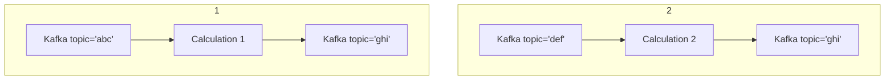

## Why `csp-gateway`?

Many `csp` users often question the necessity of `csp-gateway`.
`csp-gateway` provides 3 key functionalities on top of the `csp`:

## Dependency Injection

`csp` graphs are composed of individual nodes which are called when inputs update.
Every `node` and `graph` can itself take a collection of ticking and non-ticking arguments.
Let's say I want to create 2 version of the same graph:

1. Read from kafka topic `abc`, perform calculation `1`, write to kafka topic `ghi`
2. Read from kafka topic `abc`, perform calculation `2`, write to kafka topic `ghi`



Python code for this might look like:

```python
@csp.graph
def my_graph_1():
    kafka_in = KafkaInput(topic="abc")
    calculated = CalculationOne(kafka_in)
    KafkaOutput(topic="ghi")

@csp.graph
def my_graph_2():
    kafka_in = KafkaInput(topic="def")
    calculated = CalculationTwo(kafka_in)
    KafkaOutput(topic="ghi")

```

Here, our `KafkaInput` node takes a static argument `topic`, while our `Calculation*` nodes take a ticking argument.

`csp` code connects together nodes inside a `graph` in a point-to-point fashion.
As we build more and more `csp` graphs, if we want to avoid code duplication, we end up writing some form of _graph builder_ logic.

```python
def my_graph_builder(input_topic: str, output_topic: str, calculation: Node)
    kafka_in = KafkaInput(topic=input_topic)
    calculated = calculation(kafka_in)
    KafkaOutput(topic=output_topic)

my_graph_1 = my_graph_builder("abc", "ghi", CalculationOne)
my_graph_2 = my_graph_builder("def", "ghi", CalculationTwo)
```

As this starts to become increasingly complex, it is more and more difficult to configure graphs and nodes nested inside other graphs.

`csp-gateway` solves this by combining `csp` with [`ccflow`](https://github.com/Point72/ccflow).

`GatewayModule` instances are `ccflow` [BaseModel](https://github.com/Point72/ccflow/wiki/Key-Features#base-model) instances.
This provides type validation, coercion, and dynamic initialization via [Pydantic](https://docs.pydantic.dev/latest/).
Additionally, with `ccflow` you can overlay a configuration graph onto the initialization of your `csp-gateway` instances via [Hydra](https://hydra.cc/) / [OmegaConf](https://omegaconf.readthedocs.io/en/2.3_branch/) - See this [worked example](https://github.com/Point72/ccflow/wiki/First-Steps) for more information.

For more documentation, see [Configuration](Configuration).

## Deferred Instantiation

In a normal `csp` graph, nodes and graphs are wired together "point-to-point".
In other words, upstream nodes and graphs must be instantiated first, with subsequent instantions moving from source to sink in a downstream fashion.
Furthermore, graphs must end up acyclic by default.

- If you want to instantiate in a different order, as you may very well want to do if building something like the above section, you need to use [csp.DelayedEdge](https://github.com/Point72/csp/wiki/Feedback-and-Delayed-Edge).
- If you want a cyclic graph, you must manually insert [csp.Feedback](https://github.com/Point72/csp/wiki/Feedback-and-Delayed-Edge).

Both of these two are a bit cumbersome, and do not gel well with the `csp-gateway` "Data Bus" oriented approach.
Instead, `csp-gateway` automatically instantiates all channels in a `GatewayChannels` as `DelayedEdge`.
When a `GatewayModule` sets them, they are bound with the real edge.
If no `GatewayModule` sets them and they're not required, they are replaced with a `null_ts`.
`Feedback` instances are automatically inserted where necessary.

## REST API/UI

`csp` graphs can be difficult to interrogate, and the builtin mechanisms for doing so are `csp.print`/`csp.log` and `csp.show_graph` (generate a static `graphviz`-based graph of every node/edge).

With an automatic REST API and UI, `csp-gateway` makes it easy to see every tick of data across every relevant data stream in your `csp` graph.
Additionally, the [MountChannelsGraph](MountChannelsGraph) module provides a "30,000 foot view" of the graph, which is useful when the granular `csp.show_graph` becomes too complex.
