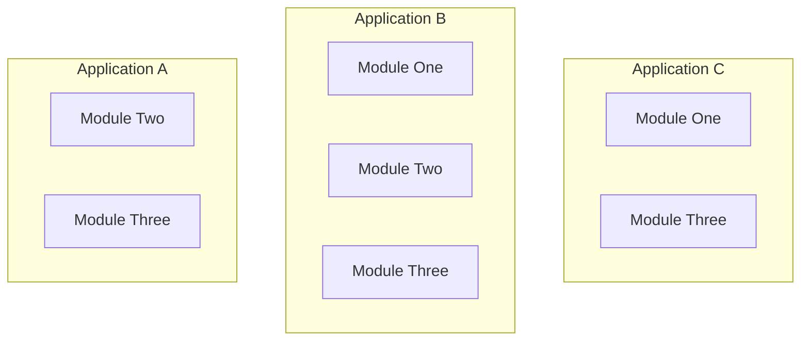

Configuration for `csp-gateway` classes is driven by [`ccflow`](https://github.com/Point72/ccflow).
`ccflow` leverages [Pydantic](https://docs.pydantic.dev/latest/) for type validation, and combines it with [Hydra](https://hydra.cc/) / [OmegaConf](https://omegaconf.readthedocs.io/en/2.3_branch/) for config-driven initialization.
The [`ccflow` examples](https://github.com/Point72/ccflow/wiki/First-Steps) provide a nice overview of its functionality.

In the context of `csp-gateway`, this means that we can control many things via yaml-based configuration.

Here is an example of a yaml-based configuration for the example `Gateway` instance in the [Overview](Overview) wiki page:

```yaml
# @package _global_
defaults:
  - /gateway: demo
  - _self_
port: 8000
```

This configuration comes directly from [Hydra](https://hydra.cc/), but its a little opaque due to the use of [defaults](https://hydra.cc/docs/advanced/defaults_list/).
Lets see what it looks like fully elaborated:

```yaml
# @package _global_
defaults:
  - _self_

modules:
  example_module:
    _target_: csp_gateway.server.demo.simple.ExampleModule
  mount_perspective_tables:
    _target_: csp_gateway.MountPerspectiveTables
    update_interval: 00:00:01
  mount_rest_routes:
    _target_: csp_gateway.MountRestRoutes
    force_mount_all: True

gateway:
  _target_: csp_gateway.Gateway
  settings:
    PORT: ${port}
    UI: True
  modules:
    - /modules/example_module
    - /modules/mount_perspective_tables
    - /modules/mount_rest_routes
  channels:
    _target_: csp_gateway.server.demo.simple.ExampleGatewayChannels

hydra:
  run:
    dir: outputs/${oc.env:HOSTNAME,localhost}_${hydra.job.name}/${now:%Y-%m-%d}/${now:%H-%M-%S}

port: 8000
```

If you're unfamiliar with Hydra/OmegaConf syntax, there are only a few things you need to know.

- `_target_` is the Python module path to a class
- Sections can be references by path, e.g. `/modules/example_module` in the `gateway` section references the `ExampleModule` instance defined in the `modules` section above it
- `${}` delineates [Interpolation](https://omegaconf.readthedocs.io/en/2.3_branch/grammar.html#interpolation-strings)

Let's break down the key parts one by one.

```yaml
# @package _global_
defaults:
  - _self_
```

This is `hydra` internals, we can skip.

```yaml
modules:
  example_module:
    _target_: csp_gateway.server.demo.simple.ExampleModule
  mount_perspective_tables:
    _target_: csp_gateway.MountPerspectiveTables
    update_interval: 00:00:01
  mount_rest_routes:
    _target_: csp_gateway.MountRestRoutes
    force_mount_all: True
```

Here we register 3 classes to be instantiated: `ExampleModule`, `MountPerspectiveTables`, and `MountRestRoutes`.
We provide `Pydantic`-validated attributes for these classes, and we could have arbitrarily nested configuration.
This provides our dependency injection so that we can configure any layer of any module directly.

> [!TIP]
>
> Hydra allows for overriding any of these via CLI.
> This is incredibly powerful, for any yaml configuration, we can extend/override any part from the command line!

```yaml
gateway:
  _target_: csp_gateway.Gateway
  settings:
    PORT: ${port}
    UI: True
  modules:
    - /modules/example_module
    - /modules/mount_perspective_tables
    - /modules/mount_rest_routes
  channels:
    _target_: csp_gateway.server.demo.simple.ExampleGatewayChannels
```

Here we instantiate our `Gateway` instance, providing the arguments outlined in [Overview#Gateway](Overview#Gateway):

- `GatewaySettings` values for `PORT` and `UI`, with `PORT` being interpolated by a global yaml value (`port:` at the left-most indentiation level)
- The list of `GatewayModule` instances, here referencing the modules instantiated previously in the leftmost `module` block
- The `GatewayChannels` instance

```yaml
hydra:
  run:
    dir: outputs/${oc.env:HOSTNAME,localhost}_${hydra.job.name}/${now:%Y-%m-%d}/${now:%H-%M-%S}
```

Here we override Hydra's default output location so that our log files are unique for each run.

> [!TIP]
>
> Hydra will also output a fully elaborated configuration yaml, so we can arbitrarily compose our config files as well!
> In the demo, we have a local (short) `demo.yaml` that overrides some values (e.g. `port`) from a provided full `demo.yaml`.
> Like CLI-based overloading, this allows for composition of components in discrete derived application instances.

```yaml
port: 8000
```

The final piece is configuring the `port` value, which is interpolated into `gateway.settings.PORT`.
If we go back to our local `demo.yaml`:

```yaml
# @package _global_
defaults:
  - /gateway: demo
  - _self_
port: 8000
```

We see that we are extending the example `demo.yaml` and setting the `port` value. You can see the local [`demo.yaml`](https://github.com/Point72/csp-gateway/blob/main/csp_gateway/server/demo/config/demo.yaml) and the template [`demo.yaml`](https://github.com/Point72/csp-gateway/blob/main/csp_gateway/server/config/gateway/demo.yaml) in the codebase.

## Putting it all together

What is the point of all this configuration? There are a number of key benefits.

First, instantiation of applications is driven via config and overrideable/extendable via other configs and CLI.
You can easily provide a "base" application to be customized further by other configurations, something like an abstract class of an application configuration.
You can extend/modify/overload arbitrarily nested objects and parameters via config file or CLI.

Finally you can compose applications in a modular fashion.
With configuration files for `Module One`, `Module Two`, and `Module Three`, you can build arbitrary combinations purely from config/CLI.


